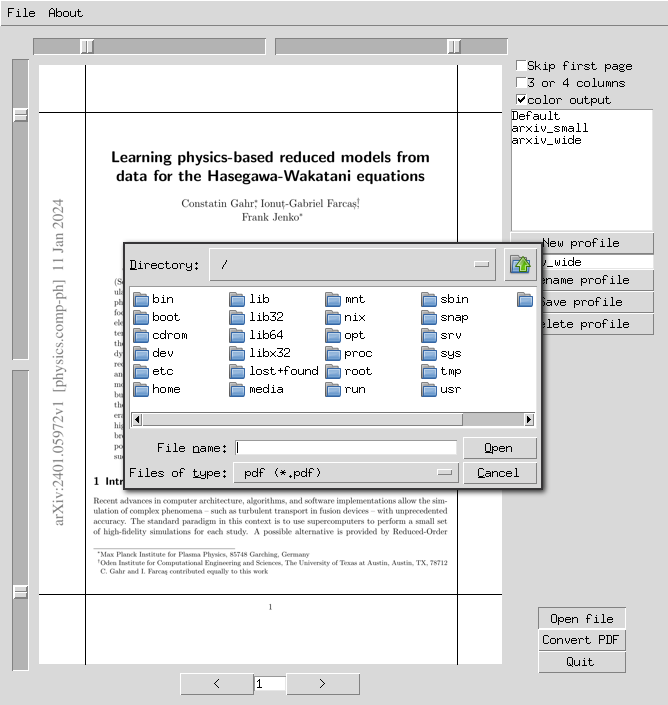

journal2ebook
=============

Graphical application to convert academic pdfs to epub format for
e-readers using k2pdfopt as a backend.

The GUI allows you to visualize your PDF and draw appropriate margins
that will be passed to k2pdfopt. The resulting pdf file is output to
the folder of your choice. There is also functionality to save and
recall journal profiles that store margin values.

This program should work cross-platform (Linux, Mac, and Windows) though it has been most extensively tested with Linux. The Windows executable is usually behind in features, but is the most recent version that has been tested in Windows. We do not currently test on Mac.

The dependencies listed in the following sections must also be met.

Requirements
------------
* Python 3.9 or higher
* `k2pdfopt` to convert pdf to epub

`k2pdfopt` must be in your system's search PATH (or installed to the journal2ebook directory).

Installation
------------

1. clone git repository
2. run `pip install .` from the root directory
3. run `journal2ebook` to run
